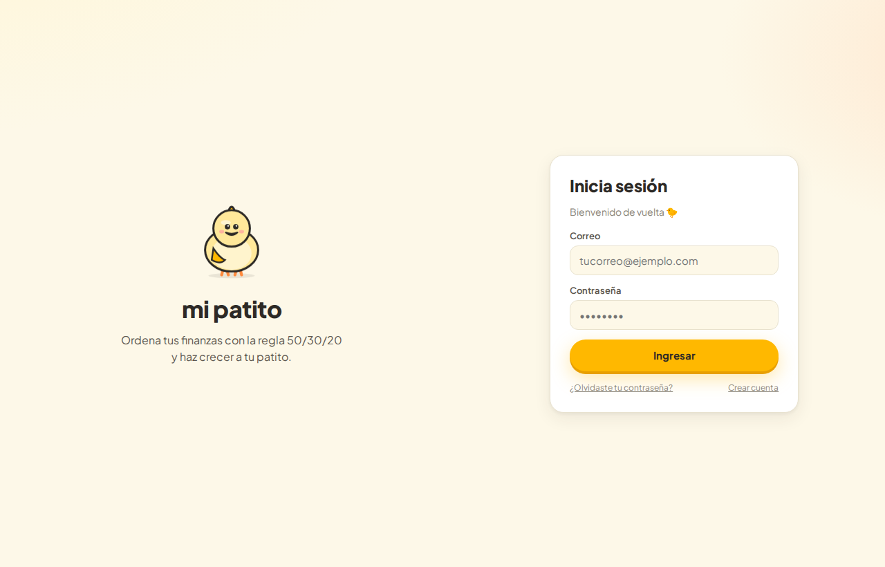
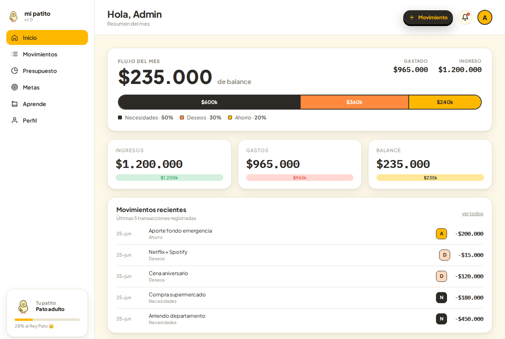
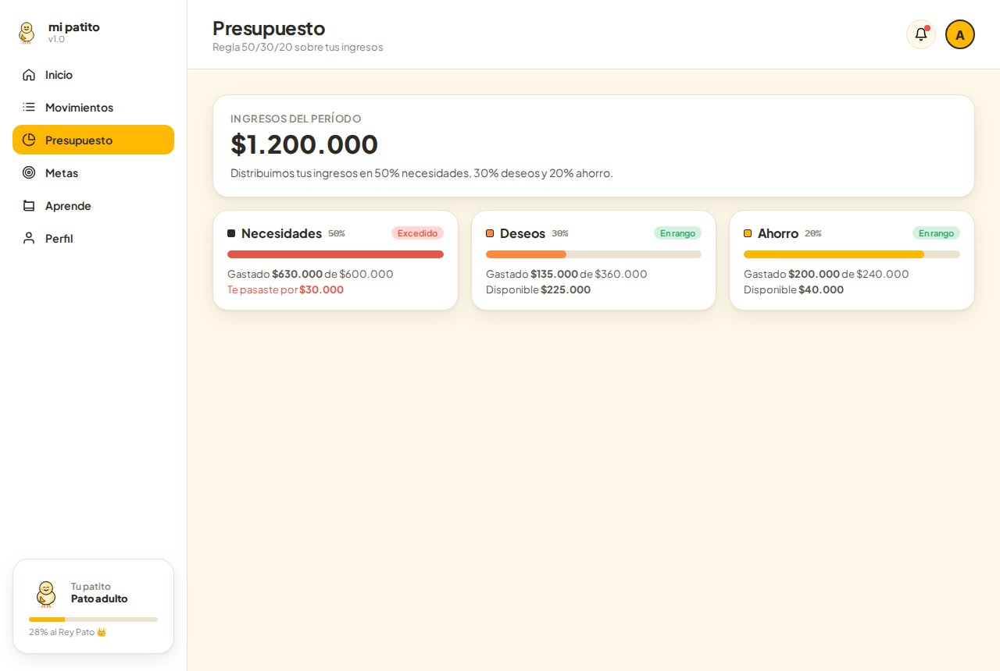

# Finanzas Mi Patito 🐣

Aplicación web de **finanzas personales** que ordena tus ingresos con la regla **50/30/20** (50% necesidades, 30% deseos, 20% ahorro) y te ayuda a visualizar tu flujo del mes con la ayuda de tu patito.



---

## Integrantes

| Nombre | Rol | GitHub |
|--------|-----|--------|
| Agustín Bahamondes | Product Owner / Analista | [@AbsolucionArtistica](https://github.com/AbsolucionArtistica) |
| Joaquín Fernández | Frontend Developer (React) | [@Folaquito](https://github.com/Folaquito) |
| Diego Bahamondez | Backend Developer (Spring Boot) | [@Eth3rn4l](https://github.com/Eth3rn4l) |

**Profesor:** Diego Patricio Cares Gonzalez
**Asignatura:** Taller Aplicado de Programación 801D — Duoc UC · 2026

---

## Características

- 🔐 **Autenticación**: registro, inicio de sesión, recuperación y cambio de contraseña (contraseñas cifradas con BCrypt).
- 💸 **Gestión financiera**: cuentas, categorías, transacciones (ingresos/gastos) y metas de ahorro (CRUD completo).
- 📊 **Regla 50/30/20**: distribuye automáticamente tus ingresos en Necesidades / Deseos / Ahorro y compara contra el gasto real, avisando cuando te excedes.
- 📈 **Dashboard**: balance del mes, ingresos vs. gastos y últimos movimientos.
- 🐤 **Patito**: una mascota que acompaña la experiencia y crece contigo.

> **Fuera de alcance:** integración real con APIs bancarias (se usan datos simulados), versión móvil nativa.

---

## Capturas

| Dashboard | Presupuesto 50/30/20 |
|-----------|----------------------|
|  |  |

---

## Stack Tecnológico

| Capa | Tecnología |
|------|-----------|
| Frontend | React 19 + Vite 8 (SPA, Context API) |
| Backend | Java 21 + Spring Boot 3.5.14 (REST API) |
| Persistencia | Spring Data JPA + H2 (desarrollo) · PostgreSQL (objetivo producción) |
| Seguridad | Spring Security + BCrypt |
| Build | Maven (backend) · npm (frontend) |
| Control de versiones | Git + GitHub |

---

## Arquitectura

Monolito Spring Boot organizado por capas, consumido por una SPA de React:

```
┌──────────────────────────────────────┐
│  Frontend — React SPA (Vite)         │
│  context · features · api (fetch)    │
└───────────────────┬──────────────────┘
                    │  REST /api (proxy Vite → :8080)
┌───────────────────▼──────────────────┐
│  Backend — Spring Boot               │
│  controller → service → repository   │
│  (lógica 50/30/20, auth, BCrypt)     │
└───────────────────┬──────────────────┘
                    │  Spring Data JPA
┌───────────────────▼──────────────────┐
│  Base de datos — H2 (dev) / Postgres │
└──────────────────────────────────────┘
```

> **Nota de arquitectura:** el diseño original contemplaba microservicios; la implementación actual es un **monolito modular** por capas (más simple de operar y desplegar para el alcance del curso). La separación en servicios queda como evolución futura.

---

## Estructura del proyecto

```
finanzas-mi-patito/
├── backend/                 # API Spring Boot
│   ├── src/main/java/com/finanzas/
│   │   ├── config/          # SecurityConfig, DataLoader (seed)
│   │   ├── controller/      # REST controllers (/api/...)
│   │   ├── service/ + impl/  # Lógica de negocio (incl. 50/30/20)
│   │   ├── repository/      # Spring Data JPA
│   │   ├── model/           # Entidades + enums
│   │   ├── dto/             # Objetos de transferencia
│   │   └── exception/       # Manejo global de errores
│   └── pom.xml
├── frontend/                # SPA React + Vite
│   └── src/
│       ├── api/             # Cliente REST
│       ├── context/         # AuthContext (sesión)
│       ├── components/      # Shell, ui, Patito, Icon
│       ├── features/        # Login, Dashboard, Presupuesto, Perfil
│       └── utils/           # Formato CLP, helpers
├── docs/                    # Documentación, diagramas y capturas
└── README.md
```

Cada módulo tiene su propio README con instrucciones detalladas:
[`backend/readme.md`](backend/readme.md) · [`frontend/README.md`](frontend/README.md)

---

## Puesta en marcha

**Requisitos:** Java 21, Maven 3.6+, Node.js 22+.

### 1. Backend (puerto 8080)

```bash
cd backend
mvn spring-boot:run
```

Al arrancar, se crea un usuario de prueba (seed):

- **Correo:** `admin@patito.com`
- **Contraseña:** `password`

Consola H2: http://localhost:8080/h2-console (JDBC: `jdbc:h2:mem:finanzas_db`).

### 2. Frontend (puerto 5173)

```bash
cd frontend
npm install
npm run dev
```

Abre http://localhost:5173. El dev server hace proxy de `/api` hacia el backend en `:8080`, así que basta con tener ambos corriendo.

---

## Modelo de datos

| Entidad | Descripción |
|---------|-------------|
| `Usuario` | Cuenta de la persona (email único, password BCrypt) |
| `Cuenta` | Cuentas del usuario (saldo en CLP) |
| `Categoria` | Catálogo con tipo `NECESIDAD` / `DESEO` / `AHORRO` |
| `Transaccion` | Ingreso o gasto asociado a una cuenta y categoría |
| `Meta` | Objetivo de ahorro con monto y fecha límite |


---

## Metodología y métricas

- **Scrum** con sprints semanales (planning, sync, review).
- **Conventional Commits** en español (`feat:`, `fix:`, `docs:`…).
- **Moneda:** siempre `BigDecimal` en CLP sin decimales.
- **Objetivo de calidad:** cobertura de pruebas ≥ 80% (en progreso para EP3) y precisión 100% en los cálculos 50/30/20.

---

Última actualización: 2026-06-25
